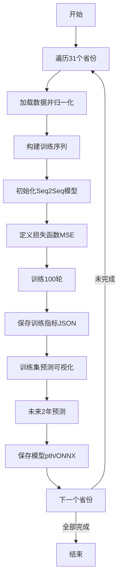

# GDP时间序列预测系统技术文档

## 目录

1. [项目概述](#项目概述)
2. [系统架构](#系统架构)
3. [模块详解](#模块详解)
4. [使用指南](#使用指南)
5. [API参考](#api参考)

---

## 项目概述

### 项目简介

本项目是一个基于深度学习的GDP预测系统,使用Seq2Seq(序列到序列)架构的LSTM神经网络,通过分析历史经济数据预测未来GDP走势。

### 核心功能

- 📊 多维度经济指标数据处理(人口、消费、GDP、财政)
- 🤖 基于LSTM的Seq2Seq时间序列预测模型
- 📈 训练过程可视化与指标监控
- 🗺️ 支持全国31个省级行政区域
- 💾 模型持久化(PyTorch格式与ONNX格式)
- 📉 预测结果可视化对比

### 技术栈

| 类别 | 技术 |
|------|------|
| 深度学习框架 | PyTorch 2.x |
| 数据处理 | Pandas, NumPy |
| 数据标准化 | Scikit-learn |
| 可视化 | Matplotlib |
| 模型导出 | ONNX |

---

## 系统架构

### 整体流程图

```
数据读取 → 数据预处理 → 序列构建 → 模型训练 → 预测评估 → 结果保存
   ↓           ↓            ↓           ↓          ↓          ↓
data_setup  MinMax标准化  utils.py   engine.py  可视化   JSON/ONNX
```

### 目录结构

```
project/
├── data_setup.py      # 数据加载与预处理
├── model_builder.py   # Seq2Seq模型定义
├── engine.py          # 训练与预测引擎
├── utils.py           # 工具函数(序列构建、可视化)
├── train.py           # 主训练脚本
└── data/              # 数据目录
    ├── YearPeople.csv     # 人口数据
    ├── YearXiaofei.csv    # 消费数据
    ├── YearGDP.csv        # GDP数据
    └── YearFinancial.csv  # 财政数据
```

---

## 模块详解

## 1. data_setup.py - 数据加载模块

### 功能概述

负责从CSV文件中读取多维经济数据,进行合并、归一化处理。

### 核心函数

#### `create_dataset(data_path: str, province: str)`

**功能**: 创建指定省份的标准化数据集

**参数**:
- `data_path` (str): 数据文件夹路径
- `province` (str): 省份名称(如"北京市")

**返回值**:
- `origin_data_reversed` (DataFrame): 原始数据(时间逆序)
- `data_scaled` (ndarray): 归一化后的数据

**处理流程**:

```python
1. 读取4个CSV文件(人口、消费、GDP、财政)
2. 提取目标省份列数据
3. 合并为DataFrame(4列特征)
4. 时间逆序排列(远→近)
5. MinMax归一化处理[0,1]
```

**数据格式示例**:

| polulation | consumption | GDP | financial |
|-----------|-------------|-----|-----------|
| 1633.0    | 8542.3      | 12406.8 | 2353.1 |
| 1695.0    | 9353.3      | 14113.6 | 2565.0 |

**关键代码解析**:

```python
# 时间序列反转(最新数据在前)
origin_data_reversed = origin_data.iloc[::-1].reset_index(drop=True)

# MinMax标准化: X' = (X - X_min) / (X_max - X_min)
scaler = MinMaxScaler()
data_scaled = scaler.fit_transform(data_for_scaling)
```

---

## 2. model_builder.py - 模型定义模块

### Seq2Seq架构原理

#### 编码器-解码器结构

```
编码器(Encoder)           解码器(Decoder)
历史序列 → LSTM → 隐状态 → LSTM → 未来预测
[t-5...t]               [t+1,t+2]
```

### 核心类: `Seq2Seq`

#### 模型参数

| 参数 | 说明 | 默认值 |
|-----|------|--------|
| input_size | 输入特征数 | 4(人口/消费/GDP/财政) |
| hidden_size | 隐藏层神经元数 | 8 |
| num_layers | LSTM堆叠层数 | 2 |
| output_size | 输出特征数 | 1(仅GDP) |
| predict_steps | 预测步数 | 2(预测2年) |

#### 前向传播流程

```python
def forward(self, x):
    # x形状: (batch_size, window_size, 4)
    
    # 阶段1: 编码历史序列
    _, (enc_hn, enc_cn) = self.encoder(x)
    # enc_hn形状: (num_layers, batch_size, hidden_size)
    
    # 阶段2: 初始化解码器
    predictions = torch.zeros(batch_size, predict_steps, 1)
    dec_input = torch.zeros(batch_size, 1, 1)  # 初始输入为0
    
    # 阶段3: 自回归预测
    for t in range(predict_steps):
        dec_output, (hn, cn) = self.decoder(dec_input, (hn, cn))
        pred = self.fc(dec_output)
        predictions[:, t, :] = pred
        dec_input = pred  # 用预测值作为下一步输入
    
    return predictions  # (batch_size, 2, 1)
```

#### 网络结构图

```
输入层(4维)
    ↓
LSTM编码器(8→8)
    ↓
隐状态传递
    ↓
LSTM解码器(1→8)
    ↓
全连接层(8→1)
    ↓
输出(GDP预测)
```

---

## 3. engine.py - 训练引擎模块

### 3.1 评估指标

#### 性能度量函数

| 指标 | 公式 | 说明 |
|-----|------|------|
| MAE | $\frac{1}{n}\sum \|y_i - \hat{y}_i \|$ | 平均绝对误差 |
| MSE | $\frac{1}{n}\sum(y_i - \hat{y}_i)^2$ | 均方误差 |
| MAPE | $\frac{100}{n}\sum\|\frac{y_i - \hat{y}_i}{y_i}\|$ | 平均绝对百分比误差 |

#### 代码实现

```python
def mae_metric(predictions, targets):
    return torch.nn.functional.l1_loss(predictions, targets)

def mse_metric(predictions, targets):
    return torch.nn.functional.mse_loss(predictions, targets)

def mape_metric(predictions, targets):
    epsilon = 1e-8  # 防止除零
    return torch.mean(torch.abs((targets - predictions) / (targets + epsilon))) * 10
```

### 3.2 训练流程

#### `train_step()` - 单轮训练

```python
关键步骤:
1. 设置模型为训练模式(model.train())
2. 遍历每个训练样本:
   - 转换为Tensor并添加批次维度
   - 前向传播计算预测值
   - 计算损失(MSE)和评估指标
   - 反向传播更新参数
3. 返回平均指标
```

#### `train()` - 完整训练循环

```python
训练监控指标:
- train_loss: 训练集MSE损失
- train_mae: 训练集平均绝对误差
- train_mse: 训练集均方误差
- train_mape: 训练集平均绝对百分比误差
- test_*: 对应的测试集指标
```

### 3.3 预测函数

#### `predict()` - 模型推理

**核心逻辑**:

```python
def predict(model, data, device):
    model.eval()  # 评估模式
    
    # 1. 数据类型转换
    if not torch.is_tensor(data):
        data = torch.from_numpy(data).float()
    
    # 2. 增加批次维度(如需要)
    if data.dim() == 2:  # (window_size, features)
        data = data.unsqueeze(0)  # → (1, window_size, features)
    
    # 3. 无梯度预测
    with torch.no_grad():
        predictions = model(data)  # (N, predict_steps, 1)
    
    # 4. 格式转换用于反归一化
    # 将GDP预测值填充到4维数组的第3列
    pre_2d = predictions.squeeze(-1)[:, 0].reshape(-1, 1)
    temp_inverse_input = np.zeros((pre_2d.shape[0], 4))
    temp_inverse_input[:, 2] = pre_2d.flatten()  # GDP在第3列
    
    return temp_inverse_input
```

**返回格式**:

```python
# 形状: (N_sequences, 4)
# 示例输出:
array([[0.   , 0.   , 预测值1, 0.   ],
       [0.   , 0.   , 预测值2, 0.   ]])
```

---

## 4. utils.py - 工具函数模块

### 4.1 序列构建

#### `create_training_sequences()`

**滑动窗口原理**:

```
时间序列: [2005, 2006, 2007, ..., 2023, 2024]
窗口大小: 6
预测步数: 2

生成样本:
X[0] = [2005-2010] → Y[0] = [2011, 2012]
X[1] = [2006-2011] → Y[1] = [2012, 2013]
...
X[N] = [2018-2023] → Y[N] = [2024, 2025]
```

**代码逻辑**:

```python
N_total = 20  # 数据总长度
input_window = 6
output_steps = 2
N_sequences = N_total - input_window - output_steps + 1  # = 13

for i in range(N_sequences):
    x_sequence = data[i : i+6, :]       # (6, 4)
    y_sequence = data[i+6 : i+8, 2]     # (2,) - 仅GDP列
    X.append(x_sequence)
    Y.append(y_sequence)

# 最终形状:
# X: (13, 6, 4)
# Y: (13, 2, 1)
```

### 4.2 可视化函数

#### `plot_training_comparison()`

**功能**: 对比训练集真实值与预测值

**绘图流程**:

```python
1. 提取GDP列(索引2)
   - true_gdp: data_y_true[:, 2]
   - pred_gdp: data_y_pred[:, 2]

2. 对齐年份
   - 起始年份 = 历史数据年份 + window_size
   - 示例: 2005数据,窗口6 → 从2011年开始对比

3. 绘制双线图
   - 蓝色实线: 真实值
   - 红色虚线: 预测值
```

#### `plot_gdp_comparison()`

**功能**: 绘制历史数据+未来预测趋势图

**特色标注**:

```python
- 灰色透明线: 全部数据概览
- 蓝色实线: 历史真实值
- 红色虚线: 未来预测值
- 黑色散点: 历史与预测分界点
```

---

## 5. train.py - 主训练脚本

### 5.1 超参数配置

```python
# 模型结构参数
INPUT_FEATURE_SIZE = 4      # 输入特征(人口/消费/GDP/财政)
OUTPUT_FEATURE_SIZE = 1     # 输出特征(仅GDP)
HIDDEN_SIZE = 8             # LSTM隐藏层
NUM_LAYERS = 2              # LSTM堆叠层数
PREDICT_STEPS = 2           # 预测未来2年

# 训练参数
WINDOW_SIZE = 6             # 历史窗口6年
BATCH_SIZE = 1              # 批次大小
NUM_EPOCHS = 100            # 训练轮数
LEARNING_RATE = 0.001       # Adam学习率

# 数据配置
GDP_COL_INDEX = 2           # GDP在数据中的列索引
PROVINCES = ["北京市", ...]  # 31个省份列表
```

### 5.2 训练流程图



### 5.3 核心代码解析

#### 数据准备阶段

```python
# 1. 加载并归一化数据
origin_data, data = data_setup.create_dataset(data_dir, PROVINCE)
scaler = MinMaxScaler()
data_scaled = scaler.fit_transform(origin_data.values)

# 2. 构建训练序列
data_x, data_y, val_Y2025, val_Y2026 = utils.create_training_sequences(
    data, WINDOW_SIZE, PREDICT_STEPS, GDP_COL_INDEX
)
# data_x: (13, 6, 4) - 13个训练样本
# data_y: (13, 2, 1) - 对应的标签
```

#### 训练与保存阶段

```python
# 3. 训练模型
results = engine.train(model, data_x, data_y, loss_fn, optimizer, NUM_EPOCHS, device)

# 4. 保存训练指标
metrics_payload = {
    'province': PROVINCE,
    'num_epochs': NUM_EPOCHS,
    'metrics': results  # 包含100轮的loss/mae/mse/mape
}
with open(metrics_path, 'w', encoding='utf-8') as f:
    json.dump(metrics_payload, f, ensure_ascii=False, indent=2)
```

#### 预测与可视化阶段

```python
# 5. 训练集预测对比
train_predictions_scaled = engine.predict(model, data_x, device)
train_predictions_unscaled = scaler.inverse_transform(train_predictions_scaled)

utils.plot_training_comparison(
    origin_data, data_x, train_predictions_unscaled, 
    data_y_true_unscaled, PROVINCE, WINDOW_SIZE, 'GDP'
)

# 6. 未来预测
final = engine.predict(model, val_Y2025, device)
final_data = scaler.inverse_transform(final)
final_gdp_values = final_data[:, GDP_COL_INDEX]

# 计算预测年份
start_year = origin_data.index[-1] + 1  # 2024 → 2025
years = range(start_year, start_year + len(final_gdp_values))  # [2025, 2026]
```

#### 模型导出阶段

```python
# 7. 保存PyTorch模型
torch.save(model.state_dict(), f"{PROVINCE}_seq2seq_gdp_model.pth")

# 8. 导出ONNX格式
dummy_input = torch.randn(BATCH_SIZE, WINDOW_SIZE, INPUT_FEATURE_SIZE).to(device)
torch.onnx.export(
    model, dummy_input, onnx_model_path,
    opset_version=17,
    input_names=['input'],
    output_names=['output'],
    dynamic_axes={'input': {0: 'batch_size'}, 'output': {0: 'batch_size'}}
)
```

---

## 使用指南

### 快速开始

#### 1. 环境准备

```bash
# 安装依赖
pip install torch pandas numpy scikit-learn matplotlib onnx tqdm

# 准备数据文件
data/
├── YearPeople.csv
├── YearXiaofei.csv
├── YearGDP.csv
└── YearFinancial.csv
```

#### 2. 数据格式要求

CSV文件格式(示例):

| 年份 | 北京市 | 天津市 | ... |
|------|--------|--------|-----|
| 2005 | 1633.0 | 1043.0 | ... |
| 2006 | 1695.0 | 1075.0 | ... |

#### 3. 运行训练

```bash
python train.py
```

#### 4. 输出结果

```
models/
├── 北京市_seq2seq_gdp_model.pth         # PyTorch模型
├── 北京市_seq2seq_gdp_model.onnx        # ONNX模型
├── 北京市_training_metrics.json        # 训练指标
└── ...
```

### 自定义配置

#### 修改预测年数

```python
# train.py中修改
PREDICT_STEPS = 3  # 改为预测未来3年
```

#### 调整历史窗口

```python
WINDOW_SIZE = 10  # 使用过去10年数据预测
```

#### 更改模型容量

```python
HIDDEN_SIZE = 16   # 增加隐藏层神经元
NUM_LAYERS = 3     # 增加LSTM层数
```

---

## API参考

### data_setup模块

```python
create_dataset(data_path: str, province: str) -> Tuple[DataFrame, ndarray]
"""
参数:
  data_path: 数据文件夹路径
  province: 省份名称
  
返回:
  origin_data_reversed: 原始数据(时间逆序)
  data_scaled: 归一化数据[0,1]
"""
```

### engine模块

```python
train(
    model: nn.Module,
    data_x: ndarray,
    data_y: ndarray,
    loss_fn: nn.Module,
    optimizer: torch.optim.Optimizer,
    num_epochs: int,
    device: str
) -> Dict[str, List[float]]
"""
返回字典包含键:
  - train_loss, train_mae, train_mse, train_mape
  - test_loss, test_mae, test_mse, test_mape
"""

predict(model: nn.Module, data: ndarray, device: str) -> ndarray
"""
返回形状: (N_sequences, 4)
第3列(索引2)为GDP预测值
"""
```

### utils模块

```python
create_training_sequences(
    data: ndarray,
    input_window: int,
    output_steps: int,
    target_index: int
) -> Tuple[ndarray, ndarray, ndarray, ndarray]
"""
返回:
  X_train: (N, input_window, 4)
  Y_train: (N, output_steps, 1)
  X_val_Y2025: (input_window, 4)
  X_val_Y2026: (input_window, 4)
"""
```

---

## 常见问题

### Q1: 为什么要时间逆序?

**A**: 使最新数据索引最大,便于构建验证集(如2024年数据用于预测2025-2026)。

### Q2: 为什么predict返回4列?

**A**: 为了与scaler的inverse_transform兼容,需要4维输入。实际只有GDP列有值。

### Q3: 训练集和测试集相同?

**A**: 是的,当前代码中train_step和test_step使用相同数据,主要用于监控过拟合。实际应用应分离验证集。

### Q4: 如何评估模型好坏?

**A**: 主要看MAPE指标,通常<10%为良好,结合可视化对比图直观判断。

---

## 性能优化建议

### 1. 数据增强

```python
# 添加更多特征
- 失业率
- CPI指数
- 进出口额
```

### 2. 模型改进

```python
# 使用注意力机制
class Seq2SeqWithAttention(nn.Module):
    def __init__(self, ...):
        self.attention = nn.MultiheadAttention(...)
```

### 3. 训练策略

```python
# 学习率调度
scheduler = torch.optim.lr_scheduler.ReduceLROnPlateau(
    optimizer, mode='min', factor=0.5, patience=10
)
```

---

## 版本更新日志

### v1.0.0 (2025-12-20)
- ✅ 实现基础Seq2Seq模型
- ✅ 支持31个省份GDP预测
- ✅ 添加ONNX导出功能
- ✅ 实现训练指标可视化

---

## 许可证

MIT License

---

**文档编写**: zzzauly
**最后更新**: 2025-12-20  
**维护者**: 项目团队