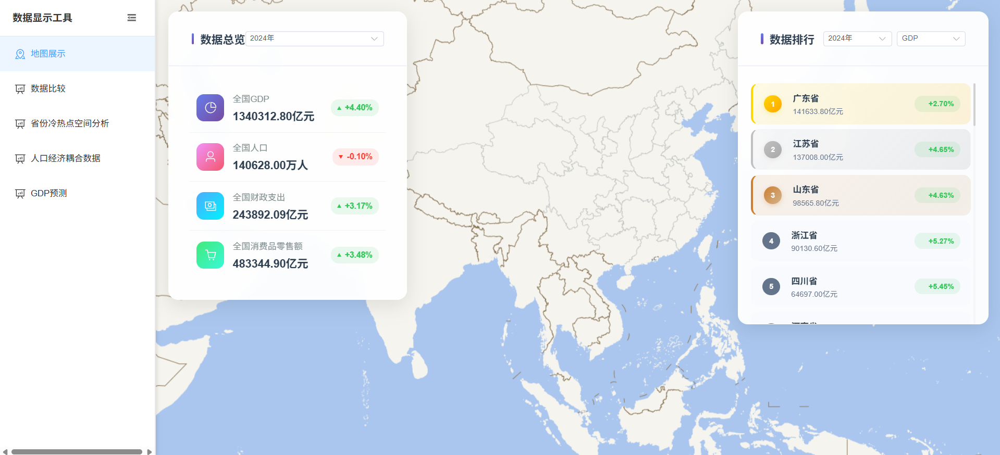
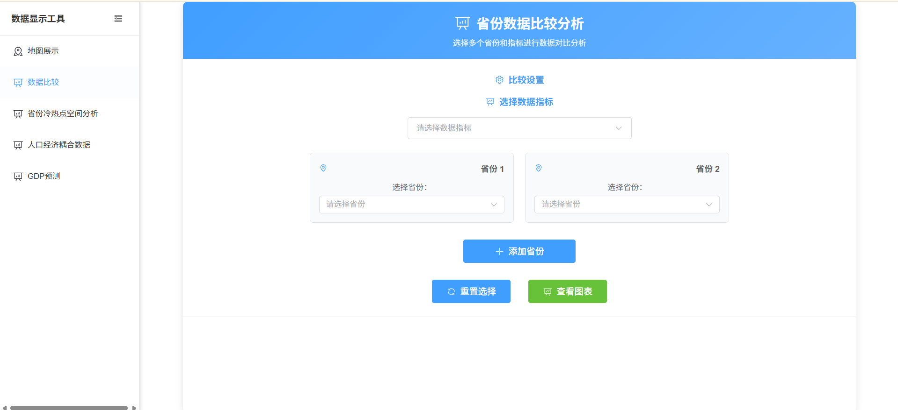
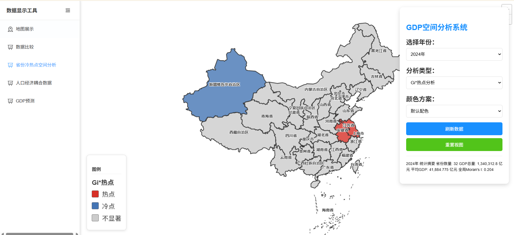
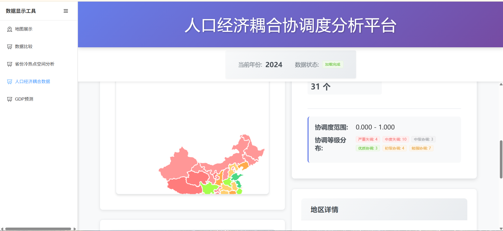
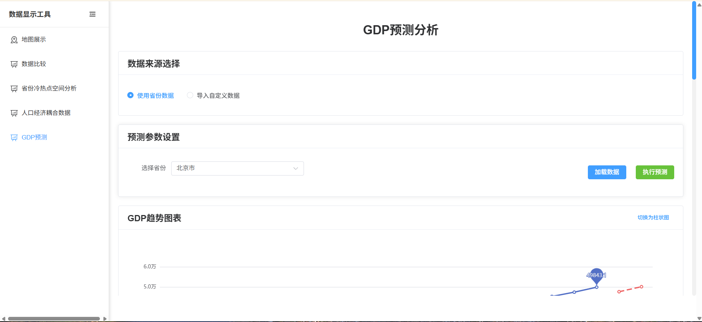
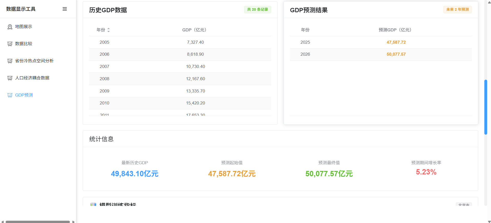
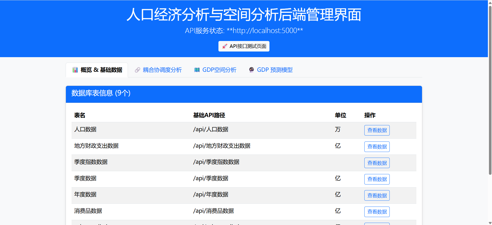
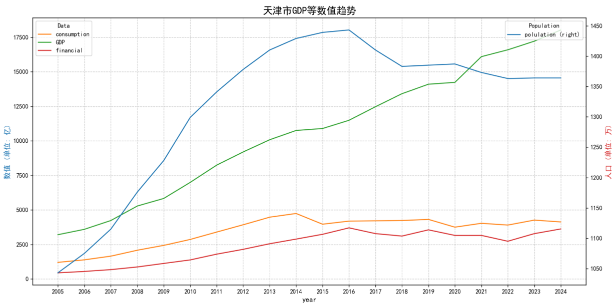
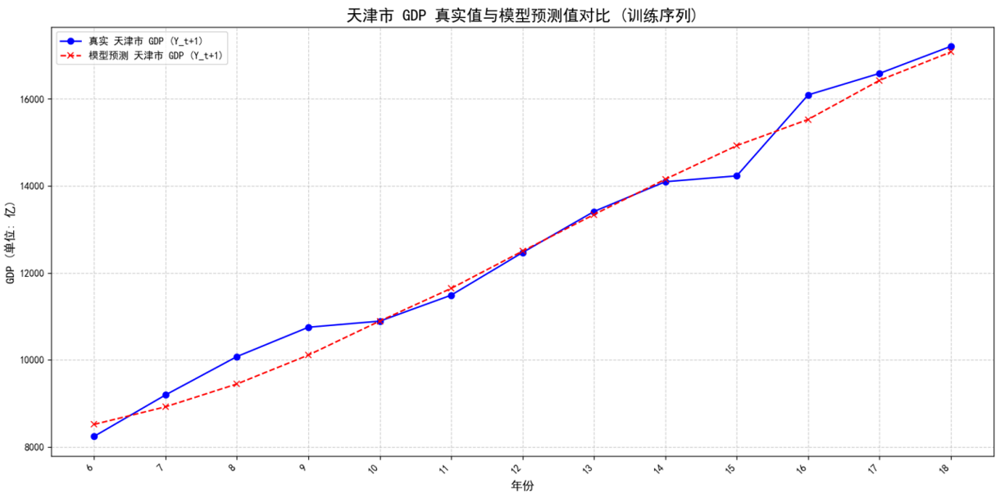
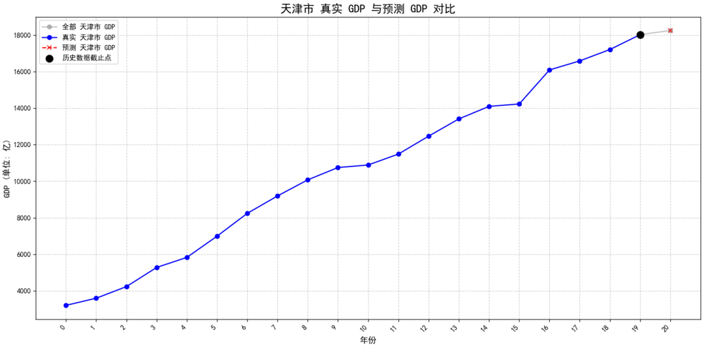

___
* 详细的技术栈和实现流程在backend_api文件夹和Prediction文件夹中有对应的介绍  
**后端部分及其预测模块均在GDP_LSTM文件夹中**  
**前端部分可视化均在GDP_yuce文件夹中**

1. 前端可视化界面  
  1.1 前端配置使用vite构建虚拟环境  
  1.2 配置完环境之后，需要将 your/GDP_yuce/GDP_yuce/src/utils/request.js里面的配置进行修改，确保自己电脑能访问到后端  
  
  
  
  
  
2. 后端管理界面  
   2.1 后端和预测均采用python构建  
   2.1 在Your/GDP_LSTM/Prediction/backend_api/config.py 需要修改你的数据库配置，并把Your/GDP_LSTM/data 中的csv文件导入到数据库中，配置大概和作者的config.py内容应该一样，不然容易出现问题。
   
3. 预测效果(拿天津做例子)
   